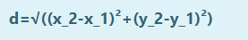

# DISTANCE-BETWEEN-TWO-POINTS

## AIM:
To write a python program to find the distance two 2 points
## ALGORITHM:
### Step 1: 
### Step 2: 
### Step 3: 
Substitute the values in the distance formula  ![formula]

### Step 4:

### Step 5: 
### PROGRAM:
  ```
  #Program to find the distance between two points.
#Developed by:Durga 
#RegisterNumber:23013532
import math
l1=[10,6]
l2=[4,2]
distance=math.sqrt(((l1[0]-l2[0])**2)+((l2[1]-l1[1])**2))
print("{:.2f}".format(distance))

  ```


### OUTPUT:


### RESULT:
Thus the distance between two points  are executed successfully

